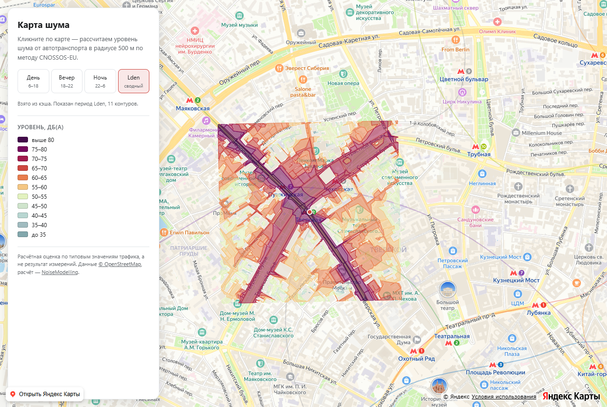

# noise-map

Карта шумового загрязнения от автотранспорта для произвольной точки на карте.
Пользователь кликает по адресу — сервис считает уровни шума вокруг него по
европейскому стандарту **CNOSSOS-EU** и рисует изофоны поверх Яндекс Карт.

Расчёт идёт по реальной физике распространения звука: учитываются экранирование
зданиями, дифракция, отражения от фасадов, поглощение грунтом и атмосферой.
Это не тепловая карта «расстояние до ближайшей дороги» — двор за домом
действительно выходит тише улицы, и это проверено (см.
[Проверка правдоподобности](#проверка-правдоподобности)).



*Lden вокруг Тверской улицы. Тёмная полоса — 70–80 дБ(A) вдоль проезжей части,
оранжевый растекается вглубь кварталов, за домами уровень падает. Круглая
граница — зона показа радиусом 750 м; масштаб карта подобрала под неё сама.*

---

## Статус

**Расчётное ядро готово и проверено.** Сквозной пайплайн от координаты до
GeoJSON изофон работает, замеры и верификация приведены ниже.

**HTTP-слой готов:** очередь с дедупликацией, кэш по сетке, SSE-прогресс, отмена
расчёта и ограничение частоты запросов по IP.

**Фронтенд работает и проверен в браузере.** Клик по карте запускает расчёт,
изофоны ложатся поверх подложки, переключение периодов суток работает.

---

## Как это устроено

```
координата (lat, lon)
        │
        ▼
  Overpass API ──────────►  extract.osm     дороги, здания, землепользование
        │                                    в радиусе (показ + дистанция распространения)
        ▼
  Import_OSM      ──────►  BUILDINGS, ROADS, GROUND
        │                   трафик проставляется по классу дороги (WG-AEN)
        ▼
  Delaunay_Grid   ──────►  RECEIVERS, TRIANGLES
        │                   сетка приёмников, ограниченная квадратом вокруг зоны показа
        ▼
  Noise_level_from_traffic ──►  RECEIVERS_LEVEL
        │                        CNOSSOS-EU: эмиссия + распространение
        │                        периоды D / E / N / DEN, октавы 63 Гц … 8 кГц
        ▼
  Create_Isosurface ────►  CONTOURING_NOISE_MAP
        │                   полигоны по диапазонам дБ(A), по одному на ячейку Делоне
        ▼
  ST_Union по уровню ──►  CONTOURING_DISSOLVED
        │                   склейка фрагментов + упрощение, пока координаты в метрах,
        │                   и обрезка по кругу радиуса показа
        ▼
  Change_SRID → Export_Table ──►  isophones.geojson  (EPSG:4326)
        │
        ▼
  округление координат до 6 знаков (~0.1 м)
```

Расчёт выполняет [**NoiseModelling 6.0.0**](https://github.com/Universite-Gustave-Eiffel/NoiseModelling)
— референсная реализация CNOSSOS-EU от Université Gustave Eiffel и CNRS.
Писать модель распространения звука с нуля — это человеко-месяцы работы и
гарантированные ошибки в физике, поэтому здесь используется движок, на котором
строят официальные стратегические карты шума по директиве ЕС 2015/996.

### Почему периоды достаются бесплатно

Затухание вдоль каждого пути «источник → приёмник» считается один раз, а эмиссия
пересчитывается под трафик каждого периода. Поэтому день, вечер, ночь и
интегральный Lden получаются за один прогон, без четырёхкратной цены.

---

## Откуда берутся данные о трафике

Это самое слабое место любой такой карты, поэтому — честно.

Яндекс.Пробки **не подходят** как источник, по двум независимым причинам:
публичного API с числовыми данными по сегментам нет (доступны только тайлы-картинки
и общегородской балл 0–10), а сама «загруженность» — это про скорость, а не про
поток. Связь между ними немонотонная: в глухом заторе машины ползут, поток близок
к нулю и шума там **меньше**, чем на свободной магистрали. Карта, построенная по
баллу пробок, местами была бы обратна реальности.

Поэтому интенсивность движения оценивается **по классу дороги в OSM**
(`highway`, `lanes`, `maxspeed`) согласно
*Good Practice Guide for Strategic Noise Mapping and the Production of Associated
Data on Noise Exposure, Version 2* (WG-AEN). Эта таблица соответствий встроена в
`Import_OSM` — то есть используется официальная европейская методичка, а не
самодельные коэффициенты.

> **Что это значит на практике.** Результат — обоснованная оценка, а не измерение.
> Геометрия, экранирование и физика распространения считаются точно; входной поток
> машин — типовой для данного класса улицы. Для сравнения районов между собой этого
> достаточно, для экспертизы или суда — нет.

Куда двигаться за точностью, если понадобится: платные исторические данные
(TomTom Traffic Stats, HERE Traffic Analytics) или открытые данные счётчиков
муниципалитета — оба варианта ложатся в таблицу `ROADS` вместо дефолтов.

---

## Требования

| | |
|---|---|
| **Node.js** | ≥ 20 |
| **Java** | проверено на OpenJDK 25 — работает, хотя NoiseModelling собран под более старую версию |
| **NoiseModelling 6.0.0** | распаковать в `.tools/nm/` (148 МБ, в git не хранится) |

```bash
npm install
cp .env.example .env    # и подставить ключ Яндекс Карт
```

Ключ JavaScript API нужен только фронтенду — расчётное ядро и HTTP-слой работают
без него. `.env` в git не попадает, в репозитории лежит только шаблон.

NoiseModelling скачивается [со страницы релизов](https://github.com/Universite-Gustave-Eiffel/NoiseModelling/releases)
(архив `NoiseModelling_6.0.0.zip`) и распаковывается так, чтобы получился путь
`.tools/nm/NoiseModelling_6.0.0/bin/ScriptRunner.bat`.

### Локальный запуск

После `npm install`, распаковки NoiseModelling и заполнения `.env` — два
терминала:

```bash
npm run server   # API на :8787, он же запускает расчёты
```

```bash
npm run web      # Vite на :5174, проксирует /api на :8787
```

Открыть **http://localhost:5174** и кликнуть по карте.

### Нужен ли прокси

**Обычно нет.** Прокси нужен только там, откуда не открывается Overpass — а
именно он поставляет исходные данные, без которых расчёт не начнётся. Проверить
это можно до всякой установки:

```bash
curl --max-time 20 https://overpass-api.de/api/status
```

Ответ вида `Connected as: …` — прокси не нужен, дальше можно не читать. Таймаут
или ошибка соединения — нужен. Наружу ходят четыре хоста: `overpass-api.de` и
зеркало `maps.mail.ru` (данные OSM), `s3.amazonaws.com` (тайлы рельефа) и
`geocode-maps.yandex.ru` (поиск по адресу). Сама карта грузится в браузере и
идёт мимо этих настроек — ей достаточно системных.

Адрес прокси прописывается в `.env`, рядом с ключами:

```bash
HTTPS_PROXY=http://127.0.0.1:10809
```

Этот файл читают и сервер, и скрипты, так что переменную достаточно записать
один раз. Подойдёт любой **HTTP-прокси** (схема `http://` или `https://`) — в
том числе локальный клиент вроде v2ray или Shadowsocks, у которых HTTP-порт
обычно соседствует с SOCKS-портом: нужен именно HTTP. Схема `socks5://` не
поддерживается — библиотека, через которую ходят запросы, её не понимает.

Переменная из оболочки перекрывает `.env`, поэтому разовый запуск можно сделать
и так:

```bash
HTTPS_PROXY=http://127.0.0.1:10809 npm run server   # bash
$env:HTTPS_PROXY='http://127.0.0.1:10809'; npm run server   # PowerShell
```

Проверить, что настройка доехала, проще всего по первой строке лога сервера: он
печатает либо `исходящие запросы через прокси …`, либо предупреждение, что
прокси не настроен. **Без прокси там, где он нужен, падает каждый расчёт, в
какую точку ни кликни** — с сообщением про недоступный Overpass.

### Первый клик

Что стоит знать до первого клика:

- **кэш в свежем клоне пуст** (`cache/` не хранится в git), поэтому первый расчёт
  для любой точки идёт честные 6–27 минут — карта при этом строится на глазах, а
  ссылка «Отменить» останавливает расчёт по-настоящему;
- **демо-точки можно прогреть заранее**, пока сервер запущен:
  `node scripts/prewarm.mjs moscow` — это те же минуты, но без ожидания у карты;
- **без ключа Яндекс Карт** карта не отрисуется, но расчёт и API работают: сервер
  можно проверить без браузера — `node scripts/smoke-api.mjs`;
- **без ключа геокодера** не работает только поиск по адресу.

Если что-то не запускается, проверьте связку с движком отдельно от веба:

```bash
node scripts/run-job.mjs --lat 55.7649 --lon 37.6055 --radius 300 --dem 0
```

Это самый дешёвый прогон целиком: Overpass, Java, NoiseModelling и выгрузка
GeoJSON — около трёх минут (замерено: 164 с, из них 160 с сам движок). Падает он
ровно там, где не хватает Java или дистрибутива в `.tools/`, и не требует ни
ключей, ни браузера.

---

## Запуск

```bash
node scripts/run-job.mjs --lat 55.7558 --lon 37.6173 --radius 750 --maxSrcDist 350 --maxArea 5000 --reflOrder 0
```

Результат — `jobs/<id>/isophones.geojson`.

### Параметры

| Флаг | Смысл | По умолчанию |
|---|---|---|
| `--lat`, `--lon` | центр расчёта, обязательные | — |
| `--radius` | радиус показа: по нему обрезается результат, приёмники строятся в описанном квадрате | `1000` |
| `--srcRadius` | радиус выгрузки OSM: до какой дали берутся источники | `radius + maxSrcDist` |
| `--maxSrcDist` | максимальная дистанция источник–приёмник | `500` |
| `--maxArea` | макс. площадь треугольника Делоне, м² — разрешение сетки | `2500` |
| `--dem` | учитывать рельеф (`1`/`0`) | `1` |
| `--diffVertical` | дифракция через крыши (`1`/`0`) | `1` |
| `--diffHorizontal` | дифракция вокруг углов зданий (`1`/`0`) | `0` |
| `--reflOrder` | порядок отражений от фасадов | `1` |
| `--simplifyTolerance` | упрощение геометрии изофон, м | `1.0` |
| `--coordDecimals` | знаков после запятой в координатах выхлопа | `6` |

### Проверка результата

```bash
node scripts/sanity-check.mjs jobs/<id>/isophones.geojson DEN
```

```bash
node scripts/inspect-geojson.mjs jobs/<id>/isophones.geojson
```

---

## Рельеф

Высоты берутся из **terrarium-тайлов** (AWS Open Data): глобальное покрытие,
без ключа и регистрации. Высота закодирована прямо в пикселе:
`(R × 256 + G + B / 256) − 32768` метров. Тайлы декодируются, значения
раскладываются на регулярную сетку и записываются в ESRI ASCII-грид, который
`Import_Asc_File` превращает в облако 3D-точек. Дальше — тот же приём, что с
изофонами: импорт в WGS84 и `Change_SRID` в рабочую метрическую проекцию.

Сетка регулярна в градусах, поэтому её ячейки не квадратные на местности. Это
безобидно: NoiseModelling всё равно превращает растр в отдельные точки и
перепроецирует каждую.

### Зачем это нужно

Мысль «в городе всё плоское» не выдерживает проверки. Замер по площадке 1.7 км:

| Место | Перепад высот |
|---|---|
| Москва, центр | 52 м |
| Москва, Тверская | 28 м |
| Москва, Хамовники | 22 м |

Пятьдесят метров на полтора километра — это уклон около 3%, и склон экранирует
звук примерно как здание.

Декодирование проверено сверкой с независимым источником: по центру Москвы
terrarium даёт 119–171 м, а SRTM30m через opentopodata — 120–170 м. Совпадение
до метра означает, что формула распаковки высоты из пикселя применена правильно,
а не даёт правдоподобный мусор.

### Что это меняет

Один и тот же участок в центре Москвы, период DEN:

| | Без рельефа | С рельефом |
|---|---|---|
| Средний уровень по площади | 64.30 дБ(A) | **63.10 дБ(A)** |
| Расчёт распространения | 67 с | **108 с** |
| Сменило диапазон | — | **9.6% площади** |

Площадь тихих диапазонов (50–60 дБ) выросла, громких (60–70 дБ) — уменьшилась.
Направление правильное: рельеф добавляет экранирование, а не убирает его. Если
бы уровни поднялись, это был бы повод искать ошибку, а не радоваться новой фиче.

Сравнение считается скриптом, а не на глаз:

```bash
node scripts/compare-runs.mjs jobs/<id>/isophones_nodem.geojson jobs/<id>/isophones_dem.geojson DEN
```

Плата — примерно **+60% ко времени расчёта**. Включено по умолчанию: без рельефа
модель молча считает город плоской плитой.

### Разрежать сетку рельефа бесполезно

Напрашивающаяся оптимизация — брать высоты пореже. Проверено и не работает:

| Сетка рельефа | Точек | Расчёт | Отличие от подробной |
|---|---|---|---|
| шаг ~28 м | 6758 | 108 с | — |
| шаг ~67 м | 1196 | 106 с | 2.2% площади |

Время не изменилось. Цена рельефа не в количестве точек, а в том, что его
включение переводит NoiseModelling на более дорогой путь расчёта профилей вдоль
лучей. Поэтому используется подробная сетка — она обходится бесплатно.

---

## HTTP-слой

```bash
npm run server        # сборка TypeScript + запуск на :8787
node scripts/smoke-api.mjs   # сквозная проверка API
```

Сервер не дублирует логику расчёта — он запускает тот же `run-job.mjs`
подпроцессом и разбирает его вывод. CLI остаётся единственным источником правды,
а всё, что добавляет сервер, — это очередь, кэш и трансляция прогресса.

| Метод | Путь | Что делает |
|---|---|---|
| `GET` | `/api/noise?lat=&lon=` | посчитано ли это место: `{id, centre, radius, cached, state?}`. Ничего не запускает |
| `POST` | `/api/noise` | `{lat, lon}` → `{id, cached, centre}`. `200` если готово, `202` если поставлено в расчёт |
| `GET` | `/api/noise/:id/events` | SSE-поток прогресса, закрывается сам по завершении |
| `GET` | `/api/noise/:id/result` | GeoJSON изофон, gzip если клиент его принимает |
| `DELETE` | `/api/noise/:id` | «больше не жду» → `{cancelled, waiters, state}`. `cancelled: false`, если задачу ждут другие |
| `GET` | `/api/noise/:id/partial/:n` | карта на момент n-го кадра, пока расчёт идёт |
| `GET` | `/api/config` | `{radius}` — что интерфейсу нужно знать до первого расчёта |
| `GET` | `/api/geocode?q=` | поиск по адресу → `{places: [{name, description, lat, lon, precision}]}` |
| `GET` | `/api/health` | проверка живости |

### Очередь и дедупликация

Одновременных расчётов по умолчанию один: распространение и так забирает все
ядра, и второй параллельный запуск делает медленнее оба. Запросы к уже
считающейся точке не создают вторую задачу, а подключаются к существующей —
два человека, кликнувшие в один квартал, разделяют один расчёт.

### Отмена расчёта

`DELETE /api/noise/:id` означает «я больше не жду этот результат», а не «убей
задачу». Разница существенна ровно из-за дедупликации: расчёт общий, и один
клиент не должен уметь оборвать его тому, кто всё ещё смотрит на прогресс.
Сервер считает ожидающих — каждый `POST`, подключившийся к задаче, добавляет
одного — и останавливает работу, когда ушёл последний. Ответ говорит, что
получилось:

```json
{ "cancelled": false, "waiters": 1, "state": { "stage": "propagation", ... } }
```

Останавливается по-настоящему, а не только на бумаге. Цепочка процессов —
сервер → `run-job.mjs` → ScriptRunner → JVM, и все ядра с 1.8 ГБ занимает
последнее звено. Убийство среднего оставило бы дорогое работать сиротой, поэтому
под Linux подпроцесс запускается лидером своей группы (`detached`) и сигнал
уходит всей группе, а под Windows дерево обходит `taskkill /T`. Проверено на
живой задаче: после отмены на стадии распространения `java.exe` пропадает из
списка процессов за несколько секунд.

Плата за `detached` — расчёт перестал умирать вместе с терминалом, поэтому
сервер снимает задачи сам по `SIGINT` и `SIGTERM` (последний шлёт `docker stop`).

Закрытая вкладка ничем не отменяет: задача досчитается и попадёт в кэш, как
раньше. Это осознанно — браузер не обещает отправить запрос при закрытии, а
отмена по обрыву SSE ломала бы обычную перезагрузку страницы.

Отменённая задача живёт как надгробие: `GET /result` отвечает `409 расчёт
отменён` вместо «ещё не готово», а следующий `POST` в ту же точку запускает
расчёт заново, а не присоединяется к несуществующему.

### Один прогон на каталог

Каталог задачи назван по точке — `jobs/<широта>_<долгота>_r<радиус>s<радиус
источников>`, — и файлы внутри имеют фиксированные имена: база H2,
`isophones.geojson`, кадры. Два прогона одной точки поэтому пишут в одну базу и
перемешивают её таблицы. Это не гипотеза: 2026-08-19 сервер сняли `taskkill /F`,
расчёт его пережил, следующий клик в ту же точку открыл ту же базу — и одна
точка дала два разных результата.

Поэтому `run-job.mjs` перед первой же записью занимает `jobs/<id>/run.lock`
(создание файла с флагом `wx` — это и есть атомарная часть), а второй прогон той
же точки не стартует и говорит почему: «эта точка уже считается — подождите и
попробуйте снова».

Лок — не просто файл, а признак жизни: владелец касается его каждые 15 секунд.
Брошенным лок считается, когда он молчит больше минуты **или** когда записавшего
его процесса уже нет. Нужны обе половины: pid переиспользуются системой, а
убитый прогон оставляет после себя ещё свежий файл — иначе отменённую задачу
нельзя было бы перезапустить раньше чем через минуту. Свой лок прогон снимает на
выходе, в том числе по `SIGINT` и `SIGTERM`, но под Windows `taskkill /F` не даёт
отработать ничему, так что надёжность держится на перехвате брошенного, а не на
уборке за собой.

Ждать освобождения вместо отказа было бы вежливее, но честного ответа «сколько
ждать» нет: занявший каталог прогон считает ту же точку и может быть в секунде
от конца, а может в получасе. Уникальный подкаталог на прогон закрыл бы ту же
дыру, но каталог заодно работает кэшем: выгрузка OSM и растр рельефа
переиспользуются следующими прогонами той же точки — это сэкономленные минуты и
снятая нагрузка с Overpass.

### Ограничение частоты запросов

Расчёт стоит минут процессорного времени, и без счётчика публичный сервис
занимается несколькими кликами. Бюджеты — токенные корзины на IP, отдельные для
разных ресурсов:

| Корзина | По умолчанию | Что защищает |
|---|---|---|
| `job` | 2 сразу, 6 в час (`JOB_LIMIT_BURST`, `JOB_LIMIT_PER_HOUR`) | ядра и память: холодный расчёт идёт минуты, и одновременно он один |
| `geocode` | 20/мин (`GEOCODE_LIMIT_RPM`) | чужую квоту — ключ Яндекса общий на весь сервис |
| `api` | 60/мин (`RATE_LIMIT_RPM`) | всё остальное от потока запросов |

Ключевое: **бюджет расчётов тратится только на запуск новой работы.** Попадание
в кэш и подключение к уже идущей задаче не стоят ничего, поэтому ходить по
прогретым местам можно сколько угодно — ограничение против занятия очереди, а не
против чтения. Отказ приходит как `429` с `Retry-After` и внятным текстом;
успешные ответы несут `RateLimit-Limit` и `RateLimit-Remaining`, чтобы клиент мог
притормозить заранее. `/api/health` не считается вовсе: платформенная проба
живости не должна упираться в лимит именно тогда, когда сервис под нагрузкой.

Корзина — а не окно — потому что трафик здесь пачками: открытие страницы делает
несколько запросов подряд, и фиксированное окно либо отклонило бы это, либо
пропустило двойную норму на стыке.

Запросы с самой машины (loopback) не ограничиваются: `prewarm.mjs` запускает
задачи подряд через тот же API, и оператор, греющий собственный кэш, — не та
нагрузка, от которой это защищает. Снимается переменной `RATE_LIMIT_LOOPBACK=1`,
она же нужна, чтобы проверить лимиты локально:

```bash
RATE_LIMIT_LOOPBACK=1 npm run server
node scripts/smoke-api.mjs
```

За обратным прокси адрес клиента виден только в `X-Forwarded-For`, и заголовок
этот подделывается тривиально — доверие к нему включается явным
`TRUST_PROXY=1`. Без него на сервере за прокси все запросы придут с одного
адреса и лимит станет общим на всех; с ним на сервере, доступном напрямую, любой
желающий отключит себе лимит одной строкой в заголовках.

### Спросить, не запуская

`POST /api/noise` отвечает на вопрос «посчитано ли здесь?» тем, что начинает
считать, — то есть узнать это стоило минут на всех ядрах и занимало очередь.
`GET /api/noise?lat=&lon=` отвечает тем же `id`, центром ячейки и радиусом, но
без побочных эффектов: он сообщает, есть ли результат в кэше и идёт ли прямо
сейчас расчёт для этой ячейки (`state`), и ничего не создаёт.

Отсюда же подсказка в интерфейсе: круг под курсором заливается, когда место уже
посчитано, — клик по нему откроется мгновенно, а не через четверть часа. Запрос
уходит не на каждое движение мыши, а когда курсор остановился, и ответы
запоминаются: иначе подсказка съедала бы весь лимит частоты на разглядывание
карты.

### Карта строится на глазах

Холодный клик стоит минуты, и всё это время показывать пустую подложку незачем:
пайплайн выгружает промежуточные карты прямо по ходу расчёта, а SSE сообщает
номер очередного кадра — геометрию по каналу статусов не гоняют, клиент забирает
кадр сам по `/api/noise/:id/partial/:n`.

Это возможно потому, что NoiseModelling пишет результаты **не в конце, а по
ходу**: `NoiseMapWriter` отдельным потоком сливает их батчами и коммитит.
Измерено на копии готовой базы — таблица уровней росла 6 148 → 41 880 → 132 548
строк, пока расчёт ещё шёл. Второе соединение к встроенной H2 из того же JVM при
этом открывается штатно, так что наблюдателю не нужно лезть во внутренности
движка.

Кадр строится из того, что уже посчитано: берутся приёмники, у которых есть
строки на все периоды, из треугольников оставляются те, у которых готовы все три
вершины, дальше — тот же путь, что у финального результата, вплоть до обрезки по
кругу. Общая функция на оба пути не случайна: разойдись они, кадр показывал бы не
то, что окажется в ответе.

Две грабли, на которые это наступило и которые стоит помнить:

- **у таблицы уровней во время расчёта нет ключа** — движок ставит его последним
  действием. Поэтому кадр строится не по живой таблице, а по её индексированному
  снимку: иначе каждый поиск приёмника превращается в полный скан и кадр не
  достраивается никогда (поток стоял в `IsoSurface` минутами);
- **промежуточной таблице готовых приёмников нужен первичный ключ** — без него
  отбор треугольников уходит в перебор.

Цена кадра — секунды, и она вычитается из тех же ядер, что считают шум, поэтому
пауза между кадрами не фиксированная: она равна девятикратной длительности
предыдущего кадра, но не меньше `PARTIAL_INTERVAL_MS`. Так накладные расходы
ограничены примерно десятой частью времени расчёта, что бы ни случилось с ценой
кадра на плотной застройке. `PARTIAL_INTERVAL_MS=0` выключает кадры совсем.

Кадры живут в каталоге задачи и **не попадают в кэш**: в кэше обязан лежать
только законченный результат, иначе следующий кликнувший получит недосчитанную
карту. Отдаются они с `Cache-Control: no-store` и удаляются вместе с задачей.

### Кэш

Клик округляется до сетки ~100 м, и эта ячейка становится ключом кэша. Расчёт
ведётся **по центру ячейки**, а не по точным координатам клика: ключ и центр
обязаны совпадать, иначе второй кликнувший получит карту, центрированную по
первому. Фактический центр возвращается в поле `centre`, чтобы интерфейс мог
показать его честно.

Повторный клик отдаётся за ~5 мс вместо ~2 минут. Оборотная сторона сеточного
округления: два клика в нескольких метрах друг от друга могут оказаться по
разные стороны границы ячейки и не разделить кэш. Это осознанный размен —
альтернатива в виде пространственного поиска ближайшего заметно сложнее.

Ключ включает и параметры расчёта, поэтому изменение радиуса или настроек
дифракции автоматически инвалидирует всё посчитанное раньше.

### Прогрев кэша

```bash
node scripts/prewarm.mjs             # пресеты moscow + spb
node scripts/prewarm.mjs moscow      # один пресет
node scripts/prewarm.mjs 55.75,37.61 # произвольная точка
```

Холодный клик стоит несколько минут — приемлемо, когда человек исследует карту,
и фатально для ссылки, которую открывают один раз. Прогрев кладёт демо-точки в
кэш заранее; всё остальное по-прежнему считается по требованию.

Скрипт следит за задачей по SSE, а не опросом `/result`: упавшая задача продолжает
отвечать `409` до вытеснения, так что опрос застопорил бы батч на десять минут
вместо внятной ошибки.

### Прогресс

Этапы транслируются по SSE с человекочитаемыми подписями. Доля шкалы отдана
пропорционально реальному времени: на распространение приходится 18–92%, потому
что именно оно занимает почти всё время. Шкала, добегающая до 90% за пару секунд
и потом замирающая на минуту, хуже, чем её отсутствие.

Внутри распространения прогресс берётся из логов NoiseModelling об обработке
ячеек — это единственный настоящий сигнал, который пайплайн отдаёт наружу.
Обновлений там немного (порядка восьми на весь этап), поэтому шкалу стоит
сглаживать на клиенте.

Период суток попадает в ссылку (`?period=N`): поделились ночным шумом — у
получателя откроется ночной, а не сводный.

Под курсором рисуется пунктирный круг радиуса расчёта — что именно покроет
клик. Во время расчёта он уступает место сплошному кругу вокруг **фактического**
центра, то есть центра ячейки кэша, а не точки клика: считается именно эта
область, и показывать надо её. Пунктир против сплошной — разница между
предложением и происходящим; отдельная подпись для этого не нужна.

Радиус приходит с сервера (`GET /api/config`), а не задан константой во
фронтенде: это параметр расчёта, и вторая копия рано или поздно нарисовала бы
круг, которому результат не соответствует.

Масштаб при открытии ссылки и после поиска адреса подбирается под круг: радиус
приходит с сервера в ответе на `POST /api/noise`, свободная часть карты —
из измеренного отступа под панель. Константа не годится, потому что двигаются оба
слагаемых: радиус — параметр расчёта, а свободная область на широком экране это
колонка рядом с панелью, на узком — полоса над нижней шторкой. Клик по карте
масштаб не трогает: пользователь сам выбрал этот вид.

Рядом со счётчиком секунд стоит ссылка «Отменить». Ожидание в интерфейсе
прекращается сразу, не дожидаясь ответа сервера: пользователю нечего делать с
информацией о том, что расчёт продолжается ради другого клиента, — для него
разницы нет, а кнопка, замирающая на время запроса, выглядела бы сломанной.

---

## Фронтенд

```bash
npm run web     # Vite на :5174, /api проксируется на :8787
```

React + TypeScript + Яндекс Карты JS API 3.0 через официальный модуль
`@yandex/ymaps3-reactify`. Изофоны рисуются как `YMapFeature` с геометрией
`MultiPolygon` прямо из ответа API — промежуточного преобразования нет, потому
что позиции GeoJSON `[lon, lat]` совпадают с `LngLat` карты.

Бутстрап карты вынесен в отдельный модуль с top-level await и **загружается
лениво**: если ключ отклонён, приложение показывает объяснение вместо белого
экрана, а панель, легенда и переключатель периодов продолжают работать.

Выбранная точка живёт в адресе — `?lat=55.7649&lon=37.6055`. Результатом можно
поделиться ссылкой, а сам проект становится воспроизводимым снаружи: скриншот
выше снят headless-браузером именно по такой ссылке, а не собран руками.

### Поиск по адресу

Строка поиска обращается к `/api/geocode`, а не к Яндексу напрямую. Причина в
ключах: у ключа JS API есть ограничение по referer, поэтому он безопасен в
браузере, а у геокодерного такого ограничения нет — попав в бандл, он был бы
доступен кому угодно. Поэтому геокодер проксируется сервером, а переменная
называется `YANDEX_GEOCODER_KEY` без префикса `VITE_`: такие Vite в браузер не
выдаёт.

Запрос отправляется по нажатию, а не на каждый символ — подсказки на лету
означали бы запрос к геокодеру на каждую букву. Выбор адреса сразу запускает
расчёт: цель продукта — узнать шум на конкретном адресе, а не просто доехать
до него камерой.

### Ключ Яндекс Карт

Нужны **два разных ключа**, и это неочевидно: JavaScript API и HTTP Геокодер —
разные продукты с разными ключами. Ключ геокодера на карте не работает.

Для ключа JS API 3.0 **обязательны ограничения** по HTTP Referer или IP. Пока
они не заданы, ключ отвергается с `403 Invalid api key` — тем же сообщением,
что и при неподключённом продукте, так что снаружи причины не различить.

В поле Referer значение вводится **без протокола и порта**: для разработки просто
`localhost`. Поле IP оставляется пустым — JS API грузится в браузере посетителя
с произвольного адреса.

Проверить ключ, не поднимая проект:

```bash
curl -s -H "Referer: http://localhost/" "https://api-maps.yandex.ru/v3/?apikey=КЛЮЧ&lang=ru_RU" -o /dev/null -w "%{http_code}\n"
```

`200` — готово. Полезная деталь: если ограничения работают, чужой referer даст
`403`, а разрешённый — `200`. Одинаковый ответ для обоих означает, что до проверки
referer дело не доходит, то есть ключу не выдан доступ к JavaScript API.

### Цветовая шкала

Используется схема **«Coloring Noise»** (Beate Tomio, 2016) — одна из палитр,
поставляемых с NoiseModelling. Выбрана не на вкус, а по измерениям.

Легаси-стандарт DIN 18005-2 (он же UNI 9884) имеет три инверсии светлоты, включая
скачок **+0.50 OKLab** прямо из тёмно-зелёного в яркий жёлтый, а два его самых
громких диапазона — 75–80 и выше 80 — различаются на **ΔE 7.7 при нормальном
зрении**. То есть именно те уровни, которые важнее всего различать, он рисует
почти одинаково. Для протанопии соседняя пара расходится всего на ΔE 3.4.

«Coloring Noise» монотонно темнеет на всех диапазонах от 55 дБ и выше — это
диапазон, в котором принимается решение (рекомендация ВОЗ по дорожному шуму —
53 дБ Lden). Её слабейшая соседняя пара приходится на тихий конец шкалы, где
цена ошибки минимальна.

Остаточная слабость — низкий контраст бледных тихих диапазонов на светлой
подложке. Компенсируется обводкой каждого полигона и текстовыми подписями в
легенде: уровень никогда не передаётся одним лишь цветом.

---

## Производительность

Центр Москвы (55.7558, 37.6173) — плотная застройка, худший случай.
Машина: 6 ядер / 12 потоков, 32 ГБ.

| Конфигурация | Расчёт | Всего | GeoJSON |
|---|---|---|---|
| квадрат 800 м, `maxSrcDist` 400, горизонтальная дифракция вкл. | 525 с | 549 с | 12.9 МБ |
| то же, горизонтальная дифракция выкл. | 320 с | 341 с | 13.6 МБ |
| зона показа 500 м через `fence`, `maxSrcDist` 500, `maxArea` 2500, отражения 1 | 176 с | 182 с | 3.3 МБ |
| зона показа 500 м через `fence`, `maxSrcDist` 350, `maxArea` 5000, отражения 0 | **70 с** | **76 с** | 3.6 МБ |
| то же + склейка полигонов, упрощение и округление координат | 70 с | 72 с | **0.64 МБ** |

Действующая рабочая точка — показ 750 м. Замер по Тверской (55.7649, 37.6055),
холодный прогон целиком, включая Overpass и рельеф:

| Шаг | Время |
|---|---|
| Overpass + рельеф (18 МБ выгрузки) | 10 с |
| `Import_OSM` + импорт растра | 9 с |
| `Delaunay_Grid` | 3 с |
| **распространение** | **789 с** |
| `Create_Isosurface` | 12 с |
| склейка + обрезка по кругу | 5 с |
| перепроецирование и экспорт | 0.3 с |
| **всего** | **829 с** |

Та же точка на радиусе 500 м считалась 365 с. Полтора радиуса стоят **2.3×**
времени: площадь приёмников растёт как квадрат (2.25×), а зона выгрузки
источников — в 1.7×. Пик памяти JVM вырос с 1836 до **2203 МБ**.

Расчёт распространения занимает **90–96%** времени; импорт, построение сетки,
изофоны, перепроецирование и экспорт вместе укладываются в секунды.
Оптимизировать имеет смысл только распространение.

### Холодный расчёт целиком

Замеры выше сделаны на уже скачанной выгрузке OSM и потому оптимистичны. Полный
цикл «клик по новому месту → результат», включая Overpass:

| Точка | Радиус 500 м, с рельефом | Радиус 750 м, с рельефом |
|---|---|---|
| Москва, Хамовники | 178 с | **354 с** |
| Москва, Тверская | 365 с | **829 с** |
| Москва, Садовое кольцо | 582 с | **1609 с** |

Полтора радиуса стоят от двух до почти трёх раз времени — тем дороже, чем плотнее
застройка: приёмников становится вдвое с четвертью больше, и каждый из них видит
больше источников. Разброс внутри столбца дают та же плотность и настроение
публичного Overpass. Поэтому в интерфейсе написано «6–27 минут» — обе границы
измерены, а не выдуманы.

Три рычага, отсортированные по эффекту:

1. **`fence` для приёмников** — считать зону показа, а не весь bbox выгрузки.
   Даёт около 3×: квадрат вокруг источников (сторона 2·850 м) втрое больше
   квадрата вокруг зоны показа (2·500 м). Именно квадрата: `Delaunay_Grid`
   берёт от переданного полигона только его envelope, поэтому кругом эта
   область не была никогда — круг появляется в самом конце, обрезкой изофон.
2. **Горизонтальная дифракция** — обход звука вокруг углов зданий. В плотной
   застройке комбинаторно дорог, даёт ~1.6×, а на картину влияет умеренно.
3. **`maxSrcDist` и `maxArea`** — прямой размен точности на скорость.

### Размер выхлопа

`Create_Isosurface` выдаёт по полигону на каждую ячейку Делоне, поэтому один
диапазон дБ приезжает сотнями смежных обрезков с общими рёбрами. Склейка через
`ST_Union` по `(PERIOD, ISOLVL)` схлопывает их в один мультиполигон на диапазон
и убирает внутренние швы. Упрощение выполняется до перепроецирования, пока
координаты в метрах, — иначе допуск пришлось бы задавать в долях градуса.

Отдельно: экспортёр пишет координаты с 14 знаками после запятой, то есть с
нанометровой точностью. Округление до 6 знаков (~0.1 м на этой широте) само по
себе срезает примерно половину объёма и заведомо ниже погрешности модели.

| | Фичей | Координатных пар | Размер |
|---|---|---|---|
| после `Create_Isosurface` | 3005 | 310 914 | 3.6 МБ |
| после склейки и упрощения | 41 | 29 841 | 1.11 МБ |
| после округления координат | 41 | 29 841 | **0.64 МБ** |

Замер сделан на радиусе 500 м; пропорции от радиуса не зависят, а абсолютный
размер — да. На рабочих 750 м Тверская даёт 43 фичи, 97 238 координатных пар,
**2.07 МБ** и 494 КБ по проводу в gzip: втрое больше пар при 2.25× площади —
разницу добирает кромка круга.

Склейка вместе с обрезкой по кругу стоит 5.4 секунды — на фоне 789 секунд
расчёта это по-прежнему бесплатно.

---

## Проверка правдоподобности

Главный риск такой модели — молча потерять экранирование зданиями. Тогда карта
выродится в «расстояние до ближайшей дороги», внешне останется правдоподобной,
и ошибку легко не заметить. Поэтому проверка автоматизирована:
`sanity-check.mjs` ищет тихие зоны рядом с громкими. Резкий перепад уровня на
дистанции в десятки метров физически возможен только за счёт преграды.

Конфигурация `radius 500 / maxSrcDist 350 / maxArea 5000`, период DEN
(исторический замер, на котором проверка ставилась):

```
period DEN: 768 polygons
  level range: 32.5 .. 82.5 dB(A)
  loud (>=70 dB): 146   quiet (<=47.5 dB): 139
  closest quiet-to-loud distance: 19 m
  median quiet-to-loud distance:  106 m
  VERDICT: sharp gradients present — building screening is active
```

Что подтверждается:

- **диапазон 32.5 … 82.5 дБ(A)** — соответствует ожидаемому для центра города:
  у крупной магистрали 75–80, в защищённом дворе ниже 45;
- **тихая зона в 19 метрах от громкой** — экранирование работает;
- **ночь заметно тише дня**: максимум 72.5 против 82.5 дБ(A), тихих полигонов
  366 против 139 — суточный профиль трафика отрабатывает.

Косвенное подтверждение того же — число диапазонов после склейки: у дня их 11,
у ночи 9, потому что ночью уровни 75–80 и 80+ просто не достигаются.

На рабочих 750 м та же проверка по Тверской даёт 2771 полигон, тот же диапазон
32.5 … 82.5 дБ(A), медиану 161 м и **минимум 1 м**. Минимум упал не потому, что
экранирование испортилось: чем больше площадь, тем больше пар «двор за фасадом»,
и рано или поздно попадается стена, за которой уровень падает с 70+ до 47.5 на
считанных метрах. Осмысленная величина здесь — медиана, и она выросла со 138 до
161 м на той же точке.

Проверка разбирает мультиполигоны на части: после склейки целый диапазон дБ
представлен одним мультиполигоном с разбросанными по карте кусками, и его общий
центроид оказался бы где-то между ними, что для теста на расстояние бессмысленно.

---

## Грабли

Выяснено экспериментально, из документации не следует.

1. **Сигнатуры `exec` у блоков различаются.** `Import_OSM`, `Delaunay_Grid`,
   `Change_SRID` принимают `(Connection, input)`. У `Noise_level_from_traffic`,
   `Create_Isosurface`, `Export_Table` есть ещё перегрузка с `ProgressVisitor`.
   Лишний третий аргумент даёт `MissingMethodException`.

2. **Нужен `Delaunay_Grid`, а не `Regular_Grid`.** `Create_Isosurface` потребляет
   таблицу `TRIANGLES`, которую создаёт только Delaunay.

3. **Дифракция выключена по умолчанию.** При `confDiffVertical: false` двор
   получается таким же шумным, как улица. Включать обязательно — иначе теряется
   весь смысл использования CNOSSOS.

4. **`confMaxSrcDist` по умолчанию 150 м.** Дальние магистрали просто выпадают
   из расчёта, и это никак не сигнализируется.

5. **Приёмники ограничиваются через `fence`**, который принимает EWKT-строку и
   сам перепроецирует её в рабочую систему координат, беря envelope.

6. **Результат выходит в метрической проекции** (UTM по долготе точки — расчёт
   требует метров), для веба нужен `Change_SRID` в EPSG:4326.

7. **Node 22 не читает `HTTPS_PROXY` для `fetch`.** На машине за прокси Overpass
   выглядит полностью недоступным — `UND_ERR_CONNECT_TIMEOUT` вместо внятной
   ошибки. Лечится `ProxyAgent` из `undici`, см. `scripts/lib.mjs`.
   `NODE_USE_ENV_PROXY` появился только в Node 24.

8. **Публичный Overpass регулярно отдаёт 504.** Одна попытка — не показатель
   доступности. Реализованы ретраи с бэкоффом по нескольким зеркалам, включая
   российское `maps.mail.ru`.

9. **SSE-слушатель срабатывает синхронно при подписке.** Если задача уже
   завершена, обработчик выполняется *внутри* вызова `subscribe`, когда его
   собственный результат ещё не присвоен — обращение к такой переменной падает
   с `ReferenceError` из временной мёртвой зоны. Заголовки к этому моменту
   отправлены, поэтому общий `catch` пытался записать ответ повторно и ронял
   весь процесс. Ничто, к чему обращается слушатель, не должно объявляться
   после него, а `catch` обязан проверять `res.headersSent`.

10. **Лаунчер движка называется по-разному на Windows и Linux.** Код запускал
    `bin/ScriptRunner.bat`, которого в linux-образе нет. Такие вещи не ловятся
    ни типами, ни тестами на машине разработчика — только попыткой представить
    себе среду запуска.

11. **`Number(null)` и `Number('')` равны нулю, а ноль — валидная координата.**
    Разбор `?lat=&lon=` без проверки на наличие параметров отправлял обычный
    адрес без параметров в Гвинейский залив и запускал там расчёт.

12. **Округление до сетки должно быть идемпотентным.** Шаг по долготе зависит от
   широты, и если считать его от *исходной* широты, то повторное округление уже
   округлённой точки даёт чуть другой шаг — рядом с границей ячейки это
   перекидывает точку в соседнюю. Одно место получало бы два разных ключа кэша.
   Лечится вычислением шага по долготе от уже округлённой широты;
   `scripts/check-quantize.mjs` проверяет инвариант на ~88 тысячах точек от Сочи
   до Мурманска.

---

## Структура

```
pipeline/
  noise_pipeline.groovy   оркестрация блоков NoiseModelling, параметры через NM_PARAMS
server/src/
  index.ts                HTTP-роуты и SSE
  queue.ts                очередь, дедупликация, разбор прогресса подпроцесса
  cache.ts                округление до сетки и дисковый кэш
  geocode.ts              прокси к HTTP Геокодеру, ключ не покидает сервер
  config.ts               параметры расчёта, подписи этапов, .env
web/src/
  App.tsx                 состояние, прогресс, легенда, переключатель периодов
  MapCanvas.tsx           карта и слой изофон
  ymaps.ts                бутстрап JS API и reactify (top-level await)
  api.ts                  клиент HTTP-слоя, включая SSE
  palette.ts              цветовая шкала уровней
scripts/
  run-job.mjs             CLI: координата -> GeoJSON
  lib.mjs                 Overpass, bbox, выбор UTM-зоны, прокси
  dem.mjs                 высоты из terrarium-тайлов -> ESRI ASCII грид
  compare-runs.mjs        сравнение двух прогонов по площади диапазонов
  sanity-check.mjs        проверка, что экранирование не потерялось
  inspect-geojson.mjs     структура выхлопа: периоды, уровни, размер
  smoke-api.mjs           сквозная проверка HTTP-слоя
  check-quantize.mjs      проверка идемпотентности округления
jobs/                     результаты прогонов (не в git)
cache/                    отдаваемые API результаты (не в git)
.tools/                   дистрибутив NoiseModelling (не в git)
```

---

## Дальше

- [x] **Склейка полигонов.** `ST_Union` по `(PERIOD, ISOLVL)` + упрощение +
      округление координат: 3.6 МБ → 0.64 МБ, 3005 фичей → 41.
- [x] **HTTP-слой:** очередь с дедупликацией, кэш по сетке ~100 м, SSE-прогресс.
      Повторный клик — ~5 мс вместо ~2 минут, отдача gzip (156 КБ против 685).
- [x] **Прогрев кэша** — `scripts/prewarm.mjs`, пресеты `moscow` и `spb`.
- [x] **Фронтенд:** React + TypeScript + Яндекс Карты JS API 3.0, слой изофон,
      легенда в дБ(A), переключатель периодов суток.
- [x] **Проверено в браузере:** изофоны рисуются поверх карты, самые громкие
      полосы идут вдоль проезжей части, ночь заметно тише дня.
- [x] **Поиск по адресу** через HTTP Геокодер, проксируемый сервером.
- [x] **Отмена расчёта и лимиты частоты:** `DELETE /api/noise/:id` снимает
      ожидающего и убивает всё дерево процессов, когда ушёл последний; бюджеты на
      IP отдельные для расчётов, геокодера и остального API.
- [x] **Учёт рельефа** через terrarium-тайлы.
- [ ] **Ж/д шум — начато и остановлено**, см. [отдельный раздел](#железнодорожный-шум--незавершённая-ветка).
      Трамваи невозможны в принципе: в каталоге CNOSSOS их нет.

---

## Деплой

Всё живёт в одном контейнере: Node отдаёт собранный фронтенд и API, JVM считает
акустику. Отдельный статик-хостинг не нужен.

```bash
VITE_YANDEX_API_KEY=... YANDEX_GEOCODER_KEY=... docker compose up --build
```

> **Образ не собирался.** Docker на машине разработки поставить не удалось:
> виртуализация выключена в BIOS (`Virtualization Enabled In Firmware: No`), а
> сессия работает без прав администратора. Чтобы собрать образ, нужно включить
> VT-x/AMD-V в прошивке, поставить Docker Desktop и WSL2 — всё три шага требуют
> перезагрузки и админских прав.
>
> Два главных риска при этом сняты статически, без запуска контейнера:
>
> - **JRE 17 подходит.** Классы NoiseModelling собраны под Java 11 (major
>   version байткода 55), локально движок работает на JDK 25 — 17 лежит между
>   ними, и совместимость гарантирована в обе стороны.
> - **Юниксовый лаунчер на месте.** В дистрибутиве есть и `bin/ScriptRunner`, и
>   `bin/ScriptRunner.bat`; Dockerfile выставляет права на первый.
>
> Непроверенным остаётся всё остальное: сама сборка образа, загрузка
> дистрибутива на этапе build, `npm ci --omit=dev` и запуск под Linux.

### Требования к железу

Это не обычное веб-приложение: холодный расчёт занимает все ядра на минуты.

| | Замерено на радиусе 750 м |
|---|---|
| Пик памяти JVM | **2203 МБ** |
| Время холодного расчёта | 354–1609 с |
| Размер образа | ~600 МБ (из них 148 МБ — дистрибутив NoiseModelling) |

Контейнеру нужно **не меньше 3 ГБ памяти**, иначе первый же холодный клик
упрётся в OOM. Бесплатные тарифы с 256–512 МБ и shared CPU не подходят.

На радиусе 500 м те же замеры давали 1836 МБ и 178–582 с: рост радиуса на
половину стоит и памяти, и времени, и это главный аргумент за `CACHE_ONLY=1`
на слабом хосте.

### Режим только из кэша

Переменная `CACHE_ONLY=1` запрещает считать новое: API отдаёт заранее прогретые
места и отвечает 503 на всё остальное. Это позволяет выложить работающую демку
на слабый хост, не открывая всем желающим возможность занять сервер на десять
минут одним кликом.

### За обратным прокси

Если перед контейнером стоит nginx или платформенный балансировщик, поставьте
`TRUST_PROXY=1` — иначе все запросы придут с адреса прокси и лимит частоты
станет общим на всех посетителей сразу. На сервере, доступном из интернета
напрямую, переменную включать нельзя: `X-Forwarded-For` подделывается одной
строкой в заголовках, и лимит перестанет работать вовсе.

### Ключи

`VITE_YANDEX_API_KEY` нужен **на этапе сборки** — Vite вшивает его в бандл. Это
безопасно: ключ ограничен по HTTP Referer и виден в исходниках страницы в любом
случае. Проверено на собранном бандле: ключ карт в нём есть, ключ геокодера —
нет, он остаётся серверным.

После деплоя **добавьте боевой домен в ограничения ключа** в кабинете Яндекса,
рядом с `localhost` — без этого карта на сайте отдаст `403 Invalid api key`.

---

## Железнодорожный шум — незавершённая ветка

Ветка доведена до расчёта эмиссии и остановлена на распространении. Код лежит в
репозитории за флагом `--rail`, **выключенным по умолчанию**, и к серверу не
подключён: дорожный расчёт он не затрагивает. Ниже — что выяснено, чтобы
возвращаться к задаче не с нуля.

### Трамваи невозможны

В каталоге подвижного состава, который поставляется с NoiseModelling, **81
запись: 80 французских составов SNCF и один высокоскоростной тестовый поезд**
(`EU1`, «TestTrain EU», 200 м, Vmax 300 км/ч). Трамваев, лёгкого рельса и метро
нет. Присвоить трамваю электричку — не приближение, а подмена физики: другая
длина, другое число источников, другие тормоза и диаметр колеса.

Параметры *пути* при этом общеевропейские (`EU0…EU10` для передаточной функции,
шероховатости, стыков, мостов), так что здесь ничего выдумывать не нужно.

### Чего нет в OpenStreetMap

Замер по Комсомольской площади, радиус 850 м — 365 поверхностных путей:

| Тег | Заполнен |
|---|---|
| `tracks` (число путей) | **0%** |
| `maxspeed` | 18% |
| `usage` | 60% |
| `service` (станционные пути) | 37% — исключены, там маневровая работа |

Числа поездов нет вообще, и в отличие от автотранспорта официальной таблицы
типовых значений для железной дороги не существует. Поэтому интенсивность
задаётся вызывающей стороной, а не выдумывается кодом.

### Что работает

Извлечение путей из OSM (`scripts/rail.mjs`), сборка `RAIL_SECTIONS` и
`RAIL_TRAFFIC`, расчёт эмиссии `Railway_Emission_from_Traffic` — на Комсомольской
получается `LW_RAILWAY` из 2682 строк.

### Обо что встало

Проход распространения не завершается за разумное время. Комсомольская — 67
CPU-минут и 3 ГБ без результата. Заведомо простая двухпутка, **8 путей вместо
365**, — 12 CPU-минут и всё ещё считала.

Время почти не зависит от числа путей, потому что растёт стоимость одного луча,
а не объём геометрии. Причин две, и они складываются:

1. **Третьоктавы вместо октав.** `Noise_level_from_source` документирует
   источники в 8 октавных полосах, а `LW_RAILWAY` выходит в третьоктавах от
   50 Гц до 10 кГц — 24 полосы на период, 72 колонки вместо 24.
2. **Директивность поезда.** При пустом `tableSourceDirectivity` включается
   диаграмма направленности CNOSSOS-EU, считаемая на каждый путь.

Дешёвого флага здесь нет: чтобы уложиться во время, третьоктавы пришлось бы
сворачивать в октавы до распространения, а это меняет и работу директивности.

### Полезное, что осталось от попытки

- `scripts/rail-probe.mjs` — сколько OSM знает о путях вокруг точки и каких
  тегов не хватает;
- `pipeline/inspect_db.groovy` — дамп схемы таблиц из базы прогона. Именно им
  выяснилось, что `LW_RAILWAY` самодостаточна и передавать её надо как
  `tableSources`, а не как отдельную таблицу эмиссии.

---

## Лицензии и данные

- **NoiseModelling** — GPLv3. Запускается **отдельным процессом** через CLI,
  а не линкуется как библиотека, поэтому копилефт не распространяется на код
  этого проекта.
- **Данные OpenStreetMap** — ODbL, требуется атрибуция © OpenStreetMap contributors.
- **Яндекс Карты JS API** — бесплатное использование только в проектах с открытым
  доступом и без коммерческого применения; копирайты и логотипы скрывать нельзя.
  Отдельно: условия запрещают сохранять и модифицировать полученные через API
  данные — ещё одна причина, по которой пробки Яндекса здесь не используются.

## Дисклеймер

Результат — расчётная оценка на основе типовых значений трафика, а не результат
измерений. Не предназначен для экспертизы, юридических споров или принятия
решений о здоровье.
